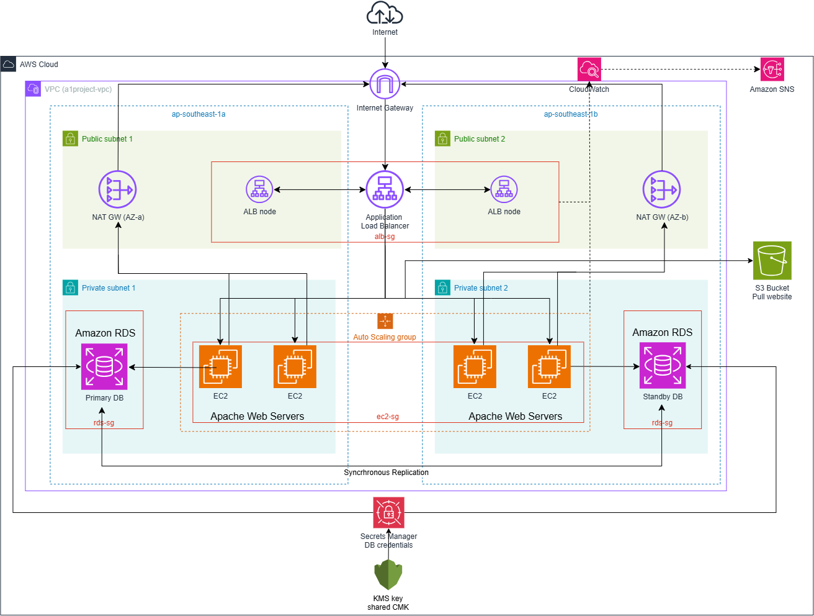

# Project 2 — v2: Modular Terraform on AWS

A 3-tier web application (ALB → ASG of EC2 → RDS MySQL) built entirely with modular,
parameterized Terraform. This is the third iteration of this project:

- **v0** — built manually in the AWS Management Console
- **v1** — rebuilt in Terraform, but everything hardcoded in one flat configuration
- **v2** (this version) — rebuilt again as 8 composable modules with variables,
  validation, conditional logic, and a decoupled root wiring layer

## Architecture



Supporting services: KMS (shared encryption key), Secrets Manager (DB credentials),
S3 (local website storage), CloudWatch + SNS (alarms and dashboard), Systems Manager
(instance access — no SSH, no bastion host, no key pairs anywhere in this build).

## Module layout

| Module | Depends on | Produces |
|---|---|---|
| `vpc` | — | VPC, public/private subnets, IGW, optional NAT |
| `security` | `vpc` | 3 chained security groups (alb → ec2 → rds) |
| `kms` | — | One shared Customer Managed Key |
| `database` | `vpc`, `security`, `kms` | RDS MySQL, Secrets Manager secret |
| `storage` | `kms` (optional) | S3 bucket, optional EC2 access IAM policy |
| `compute` | `vpc`, `security`, `storage` (optional) | Launch template, ASG, IAM instance role |
| `alb` | `vpc`, `security` | ALB, target group, HTTP listener |
| `observability` | `alb`, `compute` | SNS topic, CloudWatch alarm + dashboard |

Every dependency in that table flows one direction only — no module references a
module below it in the table, and `compute`/`alb` never reference each other at
all (see **Decoupling** below).

## Key design decisions

**No SSH, no bastion host.** EC2 instances have no key pair and no inbound port 22
anywhere. Access is via AWS Systems Manager Session Manager, using an IAM role
(`AmazonSSMManagedInstanceCore`) instead of a key file. Requires `enable_nat_gateway`
on (or a VPC endpoint) since SSM needs an outbound path to the Systems Manager
service.

**IMDSv2 enforced.** The launch template's `metadata_options` require session
tokens (`http_tokens = "required"`) and cap the hop limit at 1 — closing off a
known SSRF pattern where a vulnerable app could otherwise be tricked into
fetching the instance's IAM credentials from the metadata service.

**Credentials never leave Secrets Manager.** The database module outputs
`secret_arn`, never a username or password. Anything that needs the actual
credentials reads them from Secrets Manager at runtime.

**Decoupled ASG ↔ ALB.** Neither the `compute` nor `alb` module references the
other. The connection is a single `aws_autoscaling_attachment` resource in root
`main.tf` — the only place in the whole configuration aware both modules exist.
Either module can be modified independently without touching the other's code.

**Lifecycle-aware autoscaling.** The ASG's `lifecycle { ignore_changes =
[desired_capacity] }` stops `terraform apply` from fighting the target-tracking
scaling policy by resetting instance count on every run.

**Environment-aware safety defaults.** `skip_final_snapshot` on RDS and
`deletion_protection` on both RDS and the ALB are tied to `var.environment`,
so `dev` stays fast to tear down while `prod` gets guardrails against accidental
deletion.

**Cost-conscious toggles.** `enable_nat_gateway`, `rds_multi_az`, and
`storage_use_kms` all default to `false` — every one of them adds real
per-hour or per-request AWS cost, so they're opt-in rather than baked in.

## Terraform concepts this project demonstrates

- **Module composition** with strictly one-directional dependencies, communicated
  only through `variable` (in) and `output` (out) — never a module reaching into
  another module's resources directly.
- **The decoupling pattern**: when two modules' resources need to reference each
  other, that connection is made by a resource at the *root* level, not inside
  either module (`aws_autoscaling_attachment`, IAM policy attachment for S3 access).
- **Type-constrained, validated variables** — `validation` blocks catch bad input
  (a malformed email, an invalid environment name, an S3-incompatible project name)
  at `plan` time instead of failing deep inside an `apply`.
- **Data sources vs. resources** — `aws_caller_identity`, `aws_ami`, and
  `aws_region` look up values that already exist, keeping modules portable across
  accounts and regions instead of hardcoding account IDs, AMI IDs, or region strings.
- **Conditional resource creation** with `count = var.flag ? 1 : 0`, used for the
  optional NAT Gateway, optional storage IAM policy, and dynamic route blocks.
- **`lifecycle.ignore_changes`** to prevent Terraform from reverting infrastructure
  drift that's *supposed* to happen (autoscaling adjusting instance count).
- **Remote state with native locking** — an S3 backend with `use_lockfile = true`,
  the modern replacement for the older S3 + separate DynamoDB table pattern.
- **Provider-level `default_tags`** layered with module-level resource tags, so
  every resource gets baseline tags automatically even if a module forgets an
  explicit `tags` argument on a specific resource.
- **Secrets handled correctly**: generated with `random_password`, stored in
  Secrets Manager encrypted with a Customer Managed KMS Key, and never exposed
  through a Terraform output.

## Usage

```bash
cp terraform.tfvars.example terraform.tfvars
# edit terraform.tfvars — at minimum, set project_name and alert_email

# edit providers.tf — replace the backend "s3" bucket placeholder with your
# real state-bootstrap bucket name (backend blocks can't use variables)

terraform init
terraform plan
terraform apply
```

After apply, check the `app_url` output — refresh it a few times and the
"Served by instance" line should rotate across whatever instances the ASG is
currently running. Check your inbox for the SNS subscription confirmation
email before alarms will actually deliver.

## What's intentionally out of scope

- No HTTPS/TLS listener — no real domain to issue an ACM certificate against.
- No Kubernetes/EKS anywhere in this build (a deliberate correction — earlier
  drafts of the design notes referenced K8s-style subnet discovery tags that
  don't apply to this plain EC2/ASG/ALB architecture, and were removed).
- No SSH access path, by design — see **No SSH, no bastion host** above.
